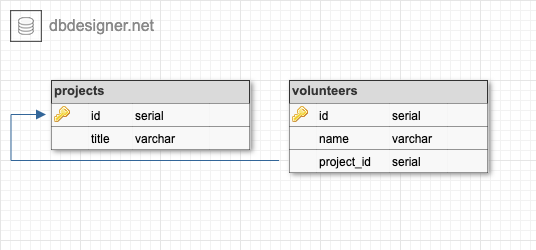

# Volunteer-Tracker

#### Epicodus Ruby and Rails - Routing with Ruby Project - 2019.07.26

#### By Ben Bennett-Cauchon

## Description

An application that tracks projects and the volunteers working on them. Each volunteer will belong to only one project (one project, many volunteers).

## User Stories

* As a non-profit employee, I want to view, add, update and delete projects.
* As a non-profit employee, I want to view and add volunteers.
* As a non-profit employee, I want to add volunteers to a project.

## Database Schema



## Setup/Installation Requirements

* clone/download the repository
* navigate to the directory in a terminal
* run the commands
```
bundle install
createdb volunteer_tracker
psql volunteer_tracker < database_backup.sql
createdb -T volunteer_tracker volunteer_tracker_test
ruby app.rb
```
* open http://localhost:4567 in a web browser

## Support and contact details

If you find a bug, run into any issues, or have questions, ideas or concerns please feel free to submit an issue for the project here on GitHub.

## Technologies Used

* ruby
* sinatra
* rspec
* capybary
* pry
* pg
* postgresql

### License

MIT License

Permission is hereby granted, free of charge, to any person obtaining a copy of this software and associated documentation files (the "Software"), to deal in the Software without restriction, including without limitation the rights to use, copy, modify, merge, publish, distribute, sublicense, and/or sell copies of the Software, and to permit persons to whom the Software is furnished to do so, subject to the following conditions:

The above copyright notice and this permission notice shall be included in all copies or substantial portions of the Software.

THE SOFTWARE IS PROVIDED "AS IS", WITHOUT WARRANTY OF ANY KIND, EXPRESS OR IMPLIED, INCLUDING BUT NOT LIMITED TO THE WARRANTIES OF MERCHANTABILITY, FITNESS FOR A PARTICULAR PURPOSE AND NONINFRINGEMENT. IN NO EVENT SHALL THE AUTHORS OR COPYRIGHT HOLDERS BE LIABLE FOR ANY CLAIM, DAMAGES OR OTHER LIABILITY, WHETHER IN AN ACTION OF CONTRACT, TORT OR OTHERWISE, ARISING FROM, OUT OF OR IN CONNECTION WITH THE SOFTWARE OR THE USE OR OTHER DEALINGS IN THE SOFTWARE.

Copyright (c) 2019 Benjamin Bennett-Cauchon
